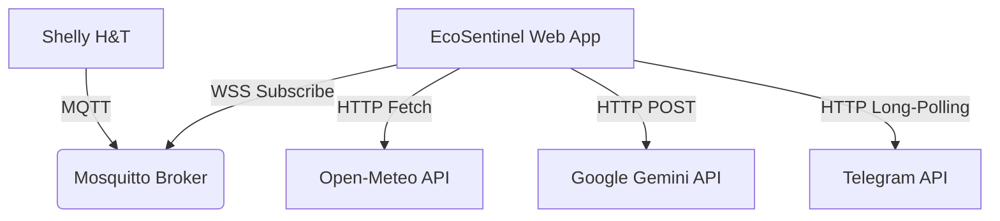

# 🌿 EcoSentinel - Advanced IoT Environmental Monitor

> **Monitorización inteligente, Física aplicada e IA Generativa para Shelly Plus H&T.**

**EcoSentinel** es una plataforma de vanguardia diseñada para transformar datos crudos de sensores IoT en inteligencia ambiental procesable. No se limita a mostrar la temperatura; analiza la física del aire, predice riesgos de salud (moho, golpes de calor), sugiere acciones de ventilación basándose en el clima exterior y permite la interacción conversacional con el hogar mediante Inteligencia Artificial.

---

## 🚀 Características Principales

### 1. 📊 Dashboard de Telemetría en Tiempo Real
- **Conexión MQTT Nativa:** Utiliza WebSockets (`wss://`) para conectarse directamente al broker MQTT sin necesidad de un backend intermedio.
- **Visualización de Datos:** Gráficos de líneas con histórico de las últimas 20 lecturas para Temperatura y Humedad.
- **Estado del Dispositivo:** Monitorización precisa de batería (Voltaje/Porcentaje), señal WiFi (RSSI) y actualizaciones de Firmware.

### 2. 🧠 Física Ambiental (Environmental Physics)
EcoSentinel no solo lee sensores, **calcula** métricas derivadas críticas utilizando fórmulas meteorológicas complejas:
- **Punto de Rocío (Dew Point):** Calculado mediante la **Fórmula de Magnus**. Es el indicador real de confort y riesgo de condensación. Si supera los 20°C, alerta sobre riesgo de moho.
- **Índice de Calor (Heat Index):** Utiliza la regresión múltiple de la **NOAA** para determinar la "sensación térmica" real basada en la combinación de calor y humedad.
- **Evaluación de Confort:** Algoritmo que determina estados como "Bochorno", "Fresco", "Confortable" o "Riesgo Crítico".

### 3. 🤖 EcoSentinel AI (Powered by Google Gemini 2.5)
Un asistente virtual integrado en el dashboard:
- **Context-Aware:** La IA recibe un "snapshot" completo de la telemetría actual, las métricas físicas derivadas y el clima exterior antes de responder.
- **Diagnóstico Técnico:** Puede actuar como un ingeniero de Shelly para diagnosticar problemas de batería o conexión.
- **Consejos de Salud:** Ofrece recomendaciones personalizadas basadas en los datos reales de tu habitación.

### 4. 📱 Bot de Telegram Proactivo
Un sistema de notificación y control bidireccional integrado directamente en el cliente web (Client-Side Polling):
- **Comandos:** `/status`, `/weather`, `/insight`, `/battery`.
- **Notificaciones Inteligentes:**
    - **Alertas:** Detecta condiciones peligrosas (ej. Alta probabilidad de moho).
    - **Recuperación:** Avisa cuando los niveles vuelven a la normalidad (🟢 Estado Normalizado).
    - **Recordatorios:** Si una alerta persiste más de 1 hora, envía un recordatorio para evitar la "ceguera de alertas".

### 5. 🌍 Comparativa Interior/Exterior (Smart Insights)
Cruza los datos del sensor interno con la API de **Open-Meteo** para generar recomendaciones lógicas:
- *"¿Debo abrir la ventana?"* -> El sistema compara la temperatura interna vs. externa y la humedad para recomendar ventilación natural solo si es beneficioso.

### 6. ⚙️ Automatización M2M (Machine-to-Machine)
Simulación de lógica de control industrial:
- **Virtual Fan:** Si la temperatura supera los 26°C, el sistema publica automáticamente un mensaje MQTT en un tópico específico (`.../virtual/fan`) para encender un ventilador ficticio, y lo apaga cuando la temperatura baja.

---

## 🛠️ Arquitectura Técnica

El proyecto sigue una arquitectura **Serverless Client-Side**:



- **Frontend:** React 19 + TypeScript + Vite.
- **Estilos:** Tailwind CSS (Diseño responsivo y modo oscuro "Slate").
- **Gestión de Estado:** React Context API (`DeviceContext`) con inmutabilidad parcial.
- **Protocolos:** MQTT sobre WebSockets, REST API.

---

## 🧮 Curiosidades y Lógica Interna

### La Fórmula del Punto de Rocío
Para calcular el riesgo de moho, usamos la aproximación de Magnus-Tetens:
```typescript
const a = 17.27;
const b = 237.7;
const alpha = (a * t) / (b + t) + Math.log(rh / 100.0);
const dewPoint = (b * alpha) / (a - alpha);
```
*¿Por qué?* La humedad relativa (RH%) es engañosa. Un 50% de humedad a 10°C es seco, pero a 30°C es muy húmedo. El punto de rocío es absoluto.

### Lógica de Notificaciones de Telegram
El hook `useTelegramBot` implementa una máquina de estados para evitar el spam:
1. **Ignora el arranque:** No envía alertas mientras el estado es "Analizando...".
2. **Detección de Cambio:** Compara el mensaje de "insight" actual con el último enviado.
3. **Cooldown:** Si el estado es peligroso y no cambia, espera **1 hora** antes de volver a molestar (Recordatorio).
4. **Resolución:** Si pasa de un estado de "Alerta" a "Confortable", envía explícitamente un mensaje de recuperación.

### Inyección de Contexto en la IA
Cuando hablas con el chat, no solo envíamos tu texto. Inyectamos un JSON oculto al sistema:
```json
{
  "system_instruction": "You are an expert Shelly IoT Engineer...",
  "context": {
    "telemetry": { "temp": 28.5, "hum": 65 },
    "derived": { "heatIndex": 32.1, "risk": "High" }
  }
}
```
Esto permite que la IA responda cosas como *"Veo que tu batería está al 15%, deberías cambiarla pronto"* sin que tú se lo digas.

---

## 📦 Instalación y Configuración

### Requisitos
- Node.js 18+
- Una API Key de Google Gemini (Gratuita en AI Studio).
- Un Bot Token de Telegram (vía @BotFather).

### Pasos
1. **Clonar y Dependencias**
   ```bash
   npm install
   ```

2. **Configuración**
   Edita `src/constants.ts`:
   ```typescript
   export const TELEGRAM_CONFIG = {
     BOT_TOKEN: 'TU_TOKEN_AQUI',
     TARGET_CHAT_ID: 'TU_CHAT_ID' 
   };
   ```
   *Nota: En producción, usa variables de entorno (`.env`).*

3. **Ejecutar**
   ```bash
   npm run dev
   ```

4. **Uso**
   Abre `http://localhost:5173`. La aplicación comenzará a escuchar el tópico MQTT público inmediatamente.

---

## 🔮 Futuro del Proyecto

- **Soporte Multidispositivo:** Gestión de array de dispositivos Shelly.
- **Persistencia:** Integración con Firebase/Supabase para historial de datos > 24h.
- **PWA:** Convertir la web en una aplicación instalable en móvil.
- **Control Activo:** Permitir cambiar configuraciones del Shelly (Thresholds) desde la UI enviando RPCs vía MQTT.

---

**Desarrollado con ❤️ y mucha cafeína.**
